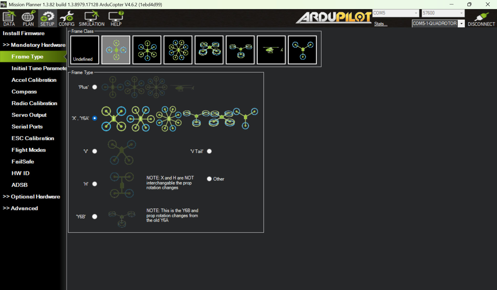
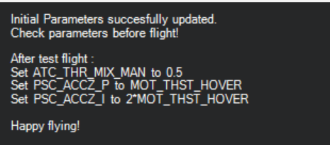
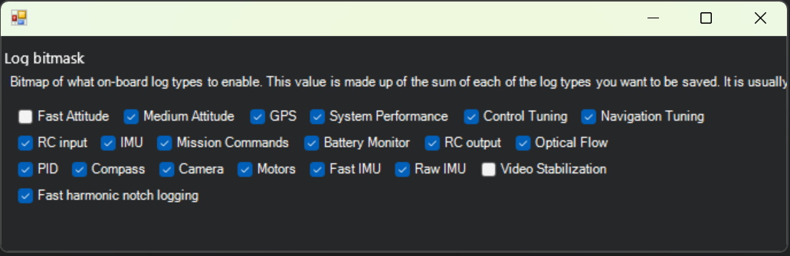

# Calibration and tuning tutorial for multi-rotors

Before conducting serious flight operations, multirotors must undergo thorough calibration and tuning to ensure reliable perception, robust control, and safe system performance. This tutorial outlines the recommended process for multirotors running the ArduPilot Copter firmware.

## Update the latest stable firmware
Always begin by updating your autopilot to the latest stable firmware. This can resolve many known issues and ensure compatibility with current features and parameters.

\* disable safety switch check:
```
BRD_SAFETY_DEFLT = 1
BRD_SAFETYOPTION = 0
```


## Misson Planner mandatory hardware configuration


Go through every item in the MP mandatory hardware configuration:
- Frame Type
- Initial Tune Parameters: After your first flight (at least 40 seconds of stable hover), reset the tuning parameters 
- Accel Calibration
- Compass Calibration: disable internal compass, calibrate compass, and reboot vehicle. External compass should be placed at least 15 cm away from the power distributed board especially when the battery current is large (e.g., 6S battery)
- Radio Calibration
- Servo Output: sanity check. No special setup unless you're configuring motor LEDs or non-standard outputs
- Serial Ports: sanity check
- ESC calibration: check type of your ESC supports and follow the instruction to implement the ESC calibration
- Flight Modes: we need at least AltHold and Stabilize
- FailSafe: swtich to QGroundControl and configure the failsafe there
- HW ID: sanity check
- ADSB

## Optional hardware configuration
- Sik Radio
- Battery Monitor
- Motor Test
- Configure `log_bitmask` as follows: 
- Set `MOT_HOVER_LEARN=2`


## Ardupilot hardware report
https://ardupilot.github.io/MethodicConfigurator/TUNING_GUIDE_ArduCopter#611-ardupilot-hardware-report 

## First flight  

Before the flight, check the following items:
- Check mass of center, which should be as close to the center of flight controller as possible 
- Check the UAV battery voltage and RC battery
- Motor test without propellers: check the motor direction
- Check propeller installation direction
- Check flight mode switch
- Check arm (throttle bottom right) and disarm (throttole bottom left) switch
- Start screen recording. Make sure that `magfield` on status in data panel is on display 


## First flights 
### Flights
- Stabilize mode
    - Increase throttle slowly without taking off. Observe oscillation or instability:
        - If oscillations occur, **immediately disarm** the vehicle. Check: Motor direction and installation, Motor wiring configuration, Propeller direction and placement, and PID gain values. Also, check methodic configurator for more information: https://ardupilot.github.io/MethodicConfigurator/TUNING_GUIDE_ArduCopter#711-check-for-motor-output-oscillation
        - No lift: If the drone does not lift off, verify that all propellers are installed in the correct orientation.

    - Review **flight messages** for warnings or errors.
    - Review the **screen recording** (if available) for flight behavior.

- AltHold mode
  - Gently lift off and hover at **1–2 meters altitude** for about **40 seconds**.
  - Land and disarm.
  - Check the value of `MOT_THST_HOVER`.
  - Update parameters:
    - `ATC_THR_MIX_MAN = 0.5`
    - `PSC_ACCZ_P = MOT_THST_HOVER`
    - `PSC_ACCZ_I = 2 × MOT_THST_HOVER`


### Download and review flight log
- Plot `CTUN.Alt` (altitude) and check associated mode, messages, errors, and events. 
- Plot `MAG.0.MagX`, `MAG.0.MagY`, `MAG.0.MagZ`. The range of magnetic field should be [300, 600]. Check the standard variance during the hovering, which should be within 80. Otherwise, magnetic interference is likely involved. 
- Check motor oscillation by plotting `RCOU.C1`, `RCOU.C2`, `RCOU.C3`, `RCOU.C4`: https://ardupilot.github.io/MethodicConfigurator/TUNING_GUIDE_ArduCopter#711-check-for-motor-output-oscillation
- Check flight controller vibration by plotting `VIBE.0.VibeX`, `VIBE.0.VibeY`, `VIBE.0.VibeZ. Normal levels are below 15m/s/s but occasionally peak to 30m/s/s. Maximum acceptable values appear to be below 30m/s/s: https://ardupilot.org/copter/docs/common-measuring-vibration.html#vibe-dataflash-log-message  
Typicall, high-end flight controllers include decent foam isolators and significantly reduce vibration. 
- Check acceleration `IMU.0.AccX`, `IMU.0.AccY`, `IMU.0.AccZ`: Acceptable AccX and AccY are between -3 and +3. For AccZ, the acceptable range is -15 to -5.

### Notch filter
A notch filter is a type of filter that removes a narrow band of frequencies from a signal while allowing all other frequencies to pass. Notch filters are used to remove motor-induced vibrations that interfere with sensors like gyroscopes (IMUs), helping to improve flight stability, reduce false sensor readings, and prevent oscillations caused by PID loops reacting to vibration noise. 

Reading about low-pass filter (accelerometers) and notch filter (gyros): https://ardupilot.org/copter/docs/common-imu-notch-filtering.html 

Load the .bin log from the first flight onto the online Ardupilot Filter Review tool Follow the instructions from Peter Hall on his Blog Post to configure the Harmonic Notch filter(s):

https://firmware.ardupilot.org/Tools/WebTools/FilterReview/  
https://discuss.ardupilot.org/t/new-fft-filter-setup-and-review-web-tool/102572 

```
INS_HNTCH_ENABLE    = 1     # enable harmonic notch
INS_HNTCH_MODE      = 1     # throttle (4 if PRM telem if available)
INS_HNTCH_REF       = 0.3   # MOT_THST_HOVER
INS_HNTCH_FREQ      = 80    # 1st notch frequency (show notch 1)
INS_HNTCH_BW        = 40    # half of 
INS_HNTCH_ATT       = 40    # default
INS_HNTCH_HMNCS     = 3     # 1st and 2nd harmonics
INS_HNTC2_OPTS      = 0     # default
```

`INS_GYRO_FILTER` is initially set by the propeller size: https://ardupilot.org/copter/docs/setting-up-for-tuning.html

For notch filtering, `INS_GYRO_FILTER = 1.2-2 x INS_HNTCH_BW` and must be greater than the initial value by propeller size. 

### QuickTune
https://ardupilot.org/copter/docs/quiktune.html 

Note that switching RC to "low" to save tune may be the case. The tuning process would take 3 minutes. 

