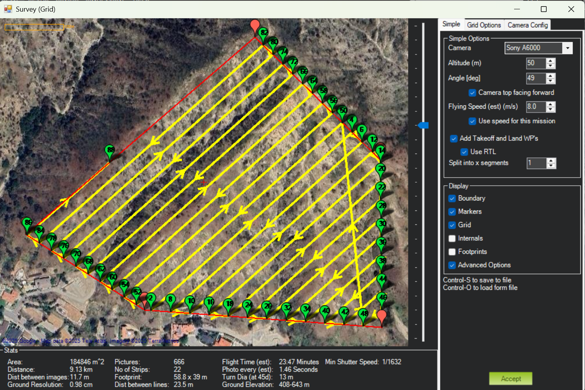

# Planning a survey mission in MP

## Configuration
Enable `TERRAIN_ENABLE` and in MP Config Planner, Map Access Mode -> ServerAndCache

## Cache map
It's always a good practice to save map cache before flying on site. 

## Plan tab in MP 
1. Right-click and select `Polygon` to draw a polygon.
2. Select `Terrain` to enable terrain following. At the same time, deselect `Verify Height`. By default, the trajectory is smooth at the waypoints. Be cautious with the spline option, as enabling it may cause overshooting.
3. Right-click to select `Auto WP -> Survey (Grid)`

    `Altitude` specifies the UAV's altitude in the selected mode (relative, absolute, or terrain). The `angle` defines the orientation of the survey lines in the horizontal plane. The camera top is the face of the horseshoe. When `Camera top facing forward` is selected, the camera is in nadir orientation.

    Navigate to the `Grid Options` panel to configure additional parameters. If `Cross Grid`, `Corridor`, and `Spiral` are deselected, the survey will follow a lawnmower pattern. To fix the UAV's heading, enable `Heading Hold`. The angle is measured counterclockwise from north.

    After completing the configuration, use the mission summary at the bottom to verify the mission details.

4. View KML: This option generates a KML file, which uses localhost ports to stream UAV data and mission information. You can open the file in Google Earth Pro to visualize the live UAV flight. This feature is particularly useful for monitoring the mission and identifying potential collisions.

5. Save waypoints as a file: It is always a good practice to back up waypoints to ensure you have a copy in case of unexpected issues.

6. Write mission: When terrain following is enabled, this action uploads the terrain data to the UAV's SD card. You can verify the upload by checking the data in `Config/MAVFtp/AMP/Terrain`.