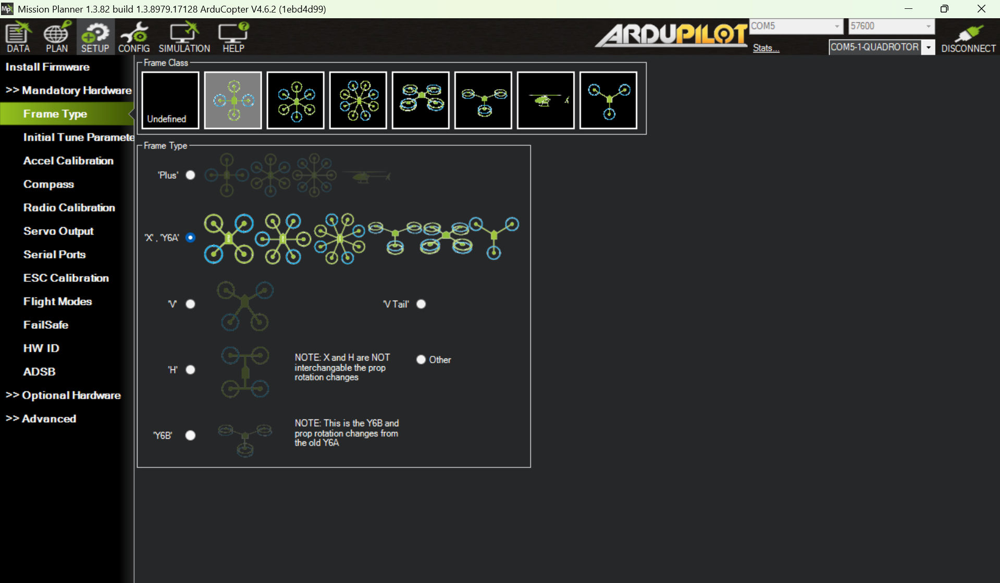
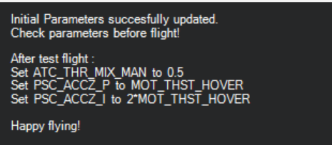

# Calibration and tuning tutorial for multi-rotors

Before conducting serious flight operations, multirotors must undergo thorough calibration and tuning to ensure reliable perception, robust control, and safe system performance. This tutorial outlines the recommended process for multirotors running the ArduPilot Copter firmware.

## Update the latest stable firmware
Always begin by updating your autopilot to the latest stable firmware. This can resolve many known issues and ensure compatibility with current features and parameters.

\* disable safety switch check:
```
BRD_SAFETY_DEFLT = 1
BRD_SAFETYOPTION = 0
```


## Misson Planner mandatory hardware configuration


Go through every item in the MP mandatory hardware configuration:
- Frame Type
- Initial Tune Parameters: After your first flight (at least 40 seconds of stable hover), reset the tuning parameters 
- Accel Calibration
- Compass Calibration: disable internal compass, calibrate compass, and reboot vehicle. External compass should be placed at least 15 cm away from the power distributed board especially when the battery current is large (e.g., 6S battery)
- Radio Calibration
- Servo Output: sanity check. No special setup unless you're configuring motor LEDs or non-standard outputs
- Serial Ports: sanity check
- ESC calibration: check type of your ESC supports and follow the instruction to implement the ESC calibration
- Flight Modes: we need at least AltHold and Stabilize
- FailSafe: swtich to QGroundControl and configure the failsafe there
- HW ID: sanity check
- ADSB

## Optional hardware configuration
- Sik Radio
- Battery Monitor
- Motor Test

## First flight  

Before the flight, check the following items:
- Check mass of center, which should be as close to the center of flight controller as possible 
- Check the UAV battery voltage and RC battery
- Motor test without propellers: check the motor direction
- Check propeller installation direction
- Check flight mode switch
- Check arm (throttle bottom right) and disarm (throttole bottom left) switch
- Start screen recording. Make sure that `magfield` on status in data panel is on display 


## First flight 
- Stabilize mode
    - Increase throttle slowly without taking off. Observe oscillation or instability:
        - If oscillations occur, **immediately disarm** the vehicle. Check: Motor direction and installation, Motor wiring configuration, Propeller direction and placement, and PID gain values. Also, check methodic configurator for more information: https://ardupilot.github.io/MethodicConfigurator/TUNING_GUIDE_ArduCopter#711-check-for-motor-output-oscillation
        - No lift: If the drone does not lift off, verify that all propellers are installed in the correct orientation.

    - Review **flight messages** for warnings or errors.
    - Review the **screen recording** (if available) for flight behavior.

- AltHold mode
  - Gently lift off and hover at **1–2 meters altitude** for about **40 seconds**.
  - Land and disarm.
  - Check the value of `MOT_THST_HOVER`.
  - Update parameters:
    - `ATC_THR_MIX_MAN = 0.5`
    - `PSC_ACCZ_P = MOT_THST_HOVER`
    - `PSC_ACCZ_I = 2 × MOT_THST_HOVER`


Download and review flight log
- Plot `CTUN.Alt` (altitude) and check associated mode, messages, errors, and events. 
- Plot `MAG.0.MagX`, `MAG.0.MagY`, `MAG.0.MagZ`. The range of magnetic field should be [300, 600]. Check the standard variance during the hovering, which should be within 80. Otherwise, magnetic interference is likely involved. 

