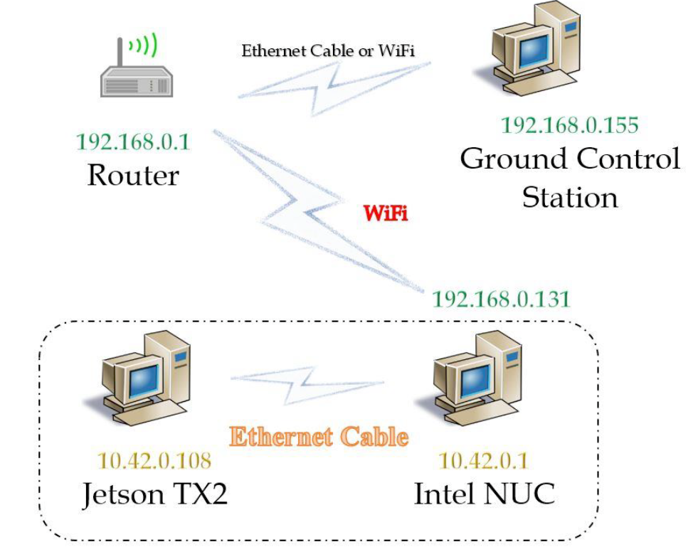
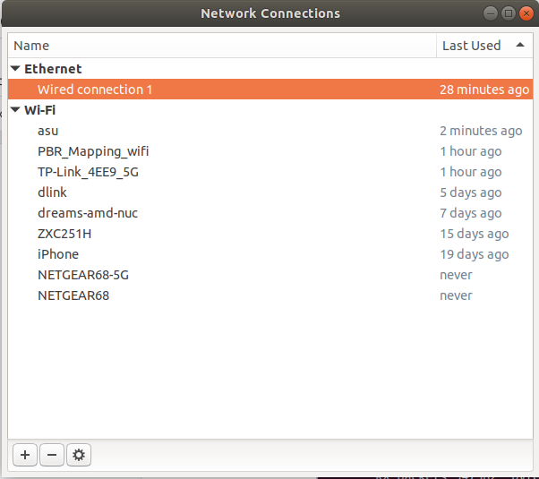

# ROS Network Configuration

## Basics
Read article: [ROS Computation Graph](http://wiki.ros.org/ROS/Concepts)

The ROS Computation Graph is the peer-to-peer (node-to-node) network of ROS processes that are processing data together. The ROS Master acts as a nameservice in the ROS Computation Graph. It stores topics and services registration information for ROS nodes. Nodes communicate with the Master to report their registration information. As these nodes communicate with the Master, they can receive information about other registered nodes and make connections as appropriate. The Master will also make callbacks to these nodes when this registration information changes, which allows nodes to dynamically create connections as new nodes are run. 

Nodes connect to other nodes directly; the Master only provides lookup information, much like a DNS server. Nodes that subscribe to a topic will request connections from nodes that publish that topic, and will establish that connection over an agreed upon connection protocol. The most common protocol used in a ROS is called TCPROS, which uses standard TCP/IP sockets. ROS uses the TCP/IP protocol to provide reliable and efficient communication between nodes on a network. Each ROS node typically runs on a separate computer or robot, and they communicate with each other by exchanging messages over TCP/IP.

*TCP (Transmission Control Protocol) is a transport protocol used in computer networking. It is one of the main protocols in the Internet Protocol suite (TCP/IP). TCP is a connection-oriented protocol, which means that before any data is transferred, a connection must be established between the sender and the receiver. During the connection establishment process, the two devices exchange information known as a handshake, which includes information such as the sequence numbers and window sizes. Once the connection is established, TCP ensures reliable transmission of data by using techniques such as error checking, retransmission of lost packets, and flow control. This means that if any data packets are lost or damaged during transmission, TCP will automatically retransmit them to ensure that the receiver gets all the data in the correct order. TCP is widely used in many applications, such as web browsing, email, file transfer, and video streaming. It is also used in many network protocols, including HTTP, SMTP, FTP, Telnet, and SSH.*

## Configuration
To run ROS on multiple machines, you need to connect them to the same *Local Area Network* (LAN) network. Only one devices can run ROS Master. 


#### Network diagram



#### Network setting
1. GCS  
	GCS is connected to an LAN port of the router via an ethernet cable, assuming that Intel NUC does not need wifi access on the GCS. If Intel NUC needs to have wifi access on GCS through the router, the router should be set as a gateway for the GCS. For gateway setting, please refer to `docs/network/materials/share_laptop_wifi.pdf`.

- Install network connection tool (GUI): `sudo apt-get install net-tools` and run the tool `nm-connection-editor`: 

- Double click “wired connection 1” for setting
- Under "IPv4 setting", the "method" should be set to "DHCP", which automatically configures the connection between the GCS and the router.


2. Router  
The “Internet connection type” should be set as “Static IP”. The IP address, subnet mask, gateway, and DNS can be arbitrary. 

	*When your router is connected with a modem: In most cases, modern routers have a feature called DHCP (Dynamic Host Configuration Protocol) that automatically configures the connection between the modem and the router. When you connect the router to the modem, the router will automatically request an IP address from the modem via DHCP. Once the router has an IP address from the modem, it will act as a gateway for devices on the local network, allowing them to access the internet through the modem. When the router receives an IP address from the modem, it will typically also set up other network configurations automatically, such as the subnet mask and default gateway. These settings ensure that devices on the local network can communicate with each other and with the internet.*

3. Intel NUC  
	Intel NUC is connected with the wifi router. Check if you can ssh from Intel NUC to GCS and vice versa. 

4. TX2  
	TX2 is connected with the Intel NUC with an ethernet cable. The method setting under "IPv4 setting" should be DHCP.

#### ROS network setting

On the ROS master machine (Intel NUC), you don’t need to export ROS_MASTER_URI or ROS_IP in the `.bashrc` file:
```
#export ROS_MASTER_URI=http://10.42.0.1:11311
#export ROS_IP=10.42.0.1
```

On GCS (ROC client 1, 192.168.0.101), set `ROS_MASTER_URI` and `ROS_IP` in the `.bashrc` file:
```
export ROS_MASTER_URI=http://192.168.0.103:11311  # 192.168.0.103 is Intel NUC’s ip address via wifi
export ROS_IP=192.168.0.101
```

Similarly, Nvidia TX2 (ROS client 2, 10.42.0.31):
```
export ROS_MASTER_URI=http://10.42.0.1:11311  # 10.42.0.1 is Intel NUC’s ip address via ethernet cable
export ROS_IP=10.42.0.31
```
The ROS_IP should be set to the IP address of the computer that the ROS node is running on. ROS nodes exchange topic and service data peer-to-peer; this means that all nodes need to be able to communicate over the network with all other nodes. Each node has a URI that it sends to the ROS master, along with its list of topics and services. When other nodes want to use a topic or service, they ask the ROS master for the URIs of the nodes on those topics, and the ROS master gives them those URIs. The other nodes then use the node's URI to establish topic and service connections. By default, a node creates its URI from the hostname of the computer that it is running on. Setting ROS_IP overrides this, and causes the node to use the specified IP address when advertising itself. 


Tips! If you want to give server a name instead ip when connecting through SSH, you can add an entry in `etc/hosts` on your server (e.g., Intel NUC),
```
10.42.0.31 tx2
192.168.0.101 gcs
```
Then you can ssh via those hostnames, e.g., `ssh username@tx2` on the Intel NUC.


## Linux Screen
Have you ever faced the situation where you perform a long-running task on a remote machine, and suddenly your connection drops, the SSH session is terminated, and your work is lost? Linux Screen allows us to resume the sessions. Using Linux Screen, you can start a screen session and then run a program inside that session. The program running in that screen session will continue to run even if you get disconnected.


First, install Screen on your server, `sudo apt install screen`. You can start a new screen,
```
screen -S uav_controller
```
Afer running a program in that session, you can detach the uav_controller session,
```
ctrl + a + d
```
You can start a new screen session, `screen -S uav_perception`. 

Common Linux Screen commands:  
`screen -r uav_controller`: re-attach a session.  
`screen -ls`: list all sessions.  
`screen -X -S [session # you want to kill] quit`: kill a session. You can also `exit` in the session to kill and quit the session.  
`pkill screen`: kill all sessions.


