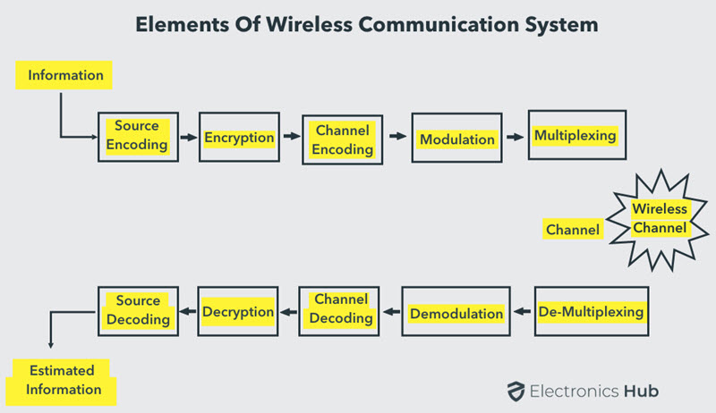

# Wireless Communication Basics

## Electromagnetic Wave

#### Wireless communication concerns

1. Interference  
	Wireless Communication systems use open space as the medium for transmitting signals. As a result, there is a huge chance that radio signals from one wireless communication system or network might interfere with other signals. The best example is Bluetooth and Wi-Fi (WLAN). Both these technologies use the 2.4GHz frequency for communication and when both of these devices are active at the same time, there is a chance of interference.
2. Security  
	One of the main concerns of wireless communication is Security of the data. Since the signals are transmitted in open space, it is possible that an intruder can intercept the signals and copy sensitive information.
3. Health concerns

## Wireless communication path
  
Source encoding removes redundant information and converts the information to digitial signals. In some cases, source encoding is also known as data compression. 

Channel encoding, also known as error-correcting coding, is the process of adding redundancy to the data to protect it from errors that may occur during transmission over a noisy channel. The goal of channel encoding is to ensure that the receiver can recover the original data even if some bits are corrupted or lost during transmission. 

Modulation is the process of modifying a signal to transmit information over a communication channel. The channel in wireless communication indicates range of frequency of transmission of signals, which depends on the transmission medium such as air, cable, and fiber-optic lines. Modulation is necessary because communication channels can only carry signals within certain frequency ranges. Modulation enables the transfer of information from one point to another by converting the information-carrying signal, also known as the baseband signal, into a higher-frequency signal, called the carrier signal, that can be transmitted over the communication channel.

Multiplexing is the process of combining multiple data streams or signals into a single transmission channel, allowing multiple users or devices to share a single communication channel. The purpose of multiplexing is to make more efficient use of the communication channel, by increasing the amount of data that can be transmitted simultaneously. 

## Wireless communication system types
Some of the important Wireless Communication Systems available today are:  
- Radio Broadcasting: 10 MHz - 100 MHz(https://en.wikipedia.org/wiki/Broadcast_band)
- Television Broadcasting: 470 MHz - 800 MHz
- Mobile Telephone System (Cellular Communication): 850MHz, 1900MHz, and others
- Satellite Communication: 3.5 GHz
- Radar: 400 MHz - 36 GHz
- Global Positioning System (GPS): L1 band: 1575.42 MHz; L2 band: 1227.60 MHz; L5: 1176.45 MHz
- WLAN (Wi-Fi): 2.4 GHz and 5 GHz
- Infrared (IR) Communication:  300 GHz - 400 THz
- Bluetooth: 2.4 GHz
- ZigBee: 2.4 GHz
- Radio Frequency Identification (RFID): The main frequencies used by passive tags are 125 KHz, 134 KHz (low-frequency), 13.56 MHz (high-frequency) and 860 to 956 MHz (ultrahigh-frequency). Active tags typically use 433 MHz, 2.45 GHz and sometimes 5.6 GHz.

Although Bluetooth and Wi-Fi both operate on the 2.4 GHz frequency band, their range is different because they use different modulation techniques and have different transmission power levels. Bluetooth uses a technique called frequency-hopping spread spectrum (FHSS), which means that it hops between different frequencies within the 2.4 GHz band many times per second. This helps to reduce interference from other devices and improve reliability, but it also limits the maximum range of Bluetooth. The maximum range of Bluetooth is typically around 10 meters (33 feet) for most devices. Wi-Fi, on the other hand, uses a technique called direct-sequence spread spectrum (DSSS) or orthogonal frequency-division multiplexing (OFDM), which allows it to transmit data at higher speeds and over longer distances. Wi-Fi also typically has higher transmission power levels than Bluetooth, which enables it to penetrate walls and other obstacles more effectively.In addition, Wi-Fi routers often use multiple antennas and beamforming techniques to improve the range and signal strength of the Wi-Fi  signal. 

Global system for mobile (GSM) communications operate on frequencies from 850 MHz to  3.5 GHz. 2G, 3G, 4G/LTE, and 5G represent the GSM generation. 

## Antennas
#### Omnidirectional (Omin) Antennas
- dipole antennas

#### Directional Antennas
- Sector antennas:  30 - 120 degrees wide; long rectangular
- Focused antennas: 5 - 10 degrees wide; dish/mesh bowl

## Transmission range
#### Power
Transmit power can be measured with two scales -- milliwatts (mW) or dBm
- A **milliwatt** is one thousandth (that’s 1/1000) of a single watt - which is a generic measurement of power.
- A **dBm** is a relative measurement using logarithms. One milliwatt is 0 dBm. 10 milliwatts is 10 dBm; 100 milliwatts is 20 dBm, 500 milliwatts is 27 dBm, and so on. 

#### Receive Sensitivity
Receive sensitivity is a measure of the ability of a wireless receiver to detect and process weak signals. It is the minimum power level of the received signal that the receiver can reliably detect and decode.

Receive sensitivity is typically expressed in terms of signal-to-noise ratio (SNR) or received power level (in dBm or mW), usually in the range of -40dBm to -80dBm. The lower (more negative) the receive sensitivity, the better the receiver's ability to detect and process weak signals. A receiver with low receive sensitivity can detect and process signals at longer distances or through obstacles, while a receiver with higher receive sensitivity may only be able to operate effectively at shorter distances or in environments with high signal strength.

#### transmission
The wireless transmission is susceptible to a variety of transmission impediments such as path loss, fading, interference and blockage. 

1. Path loss  
$$P_{r} = P_{t}G_{t}G_{r}(\frac{\lambda}{4\pi d})^2$$  
where $P_{r}$ is received power, $P_{t}$ is transmitted power, $G_{t}$ is the transmitter antenna gain, $G_{r}$ is the receiver antenna gain, $\lambda$ is the wavelength of the signal, and $d$ is the distance the transmitter and receiver. Two-path model 

2. Fading  
Fading refers to the fluctuations in signal strength when received at the receiver. Fast fading is resulted from the three propagation mechanisms: (1) Reflection, (2) Diffraction, (3) Scattering. Slow fading occurs when transmission medium that between the transmitter and receiver partially absorb the transmission. Attenuation can be caused by fast fading and slow fading. Obstacles can cause signal propagation impairments that lead to fading. 

3. Interference  
Other electronic devices in the environment can produce electromagnetic interference that can interfere with the WiFi signal. Adjacent channel interference: signals in nearby frequencies have components outside their allocated ranges, and these components may interfere with on-going transmission in the adjacent frequencies. Co-channel interference: sometimes also referred to as narrow band interference, is due to other nearby systems using the same transmission frequency.

## Wireless Fidelity (Wi-Fi)
Wi-Fi is a specific subset of wireless communications defined by a set of technical specifications outlined by the IEEE under the designation 802.11. The wireless industry has seen multiple Wi-Fi standards, among them 802.11a/b/c/g/n/ac/ax, each providing different performance characteristics. Wi-Fi networks have their own security protocols, which augment network control and access policies that might already be in place. The most recent standard, 802.11ax, is now identified as Wi-Fi 6. A variation of Wi-Fi 6, dubbed Wi-Fi 6E, features capabilities enabled in part by its use of the 6 GHz spectrum. The next iteration of the standard, 802.11be, is also called Wi-Fi 7 and is expected to be released in 2024.

An access point (AP) is a networking device that allows Wi-Fi-enabled devices to connect to a wired network. An access point acts as a central transmitter and receiver of wireless signals. Some access points may also support multiple Wi-Fi standards, such as 802.11n and 802.11ac, and multiple frequency bands, such as 2.4 GHz and 5 GHz, to provide greater flexibility and support for a wider range of devices. On the other hand, a point-to-point (P2P) network is a wireless connection between two devices, such as two computers or two access points. P2P networks are designed to connect two devices directly to each other wirelessly. P2P network usually has smaller coverages. 

There are two types of Wi-Fi signal, based on the frequencies they use:  
1. 2.4GHz - A lower frequency, this is the more common Wi-Fi technology in use today. Many devices use it, so the signals can become more crowded and interfere with each other. It can pass through walls and windows fairly well.
2. 5GHz - This higher frequency technology is used by fewer devices, and can sometimes achieve higher speeds because the frequencies are less crowded. It cannot pass through walls and windows as well as the 2.4GHz band signals, so the range of 5GHz technology is often shorter.

