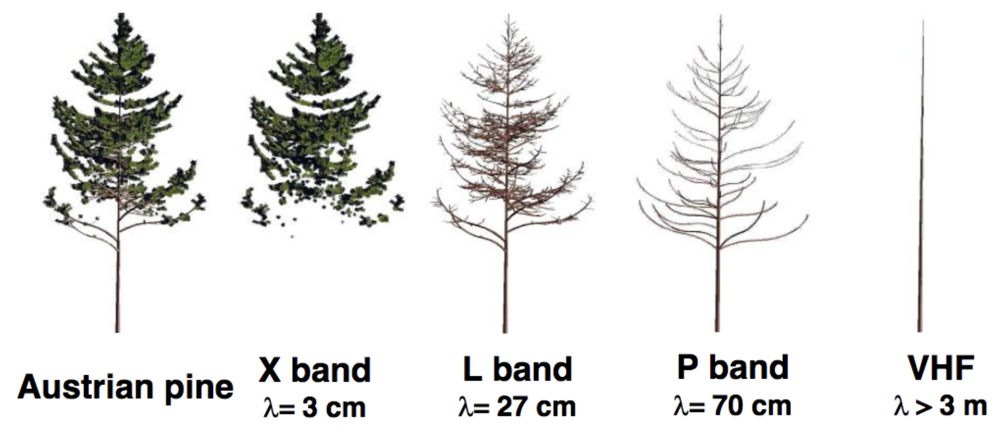

# InSar Basics
## Radio detection and ranging (Radar)
Radar is an active system, which generates its own radio waves and transmits them from its antenna, toward a target. Depending on the target properties and the imaging geometry, the radar antenna will receive all, some, or none of the radio wave’s energy (this is the Detection part of RADAR). This received signal will travel for an amount of time proportional to the target’s distance from the antenna (this is the Ranging part of RADAR). The wavelength ranges from 3 cm to a few meters. 

As the satellite moves forward, the antenna receives the radar echoes reflected from the ground, and the received signals are recorded. To create a high-resolution image of the ground, the antenna must scan across the ground in a specific pattern, typically using a technique called side-looking radar. The antenna is electronically steered to scan across the ground and collect radar data in multiple directions. 

**Range** refers to the across-track dimension perpendicular to the flight direction, while **azimuth** refers to the along-track dimension parallel to the flight direction. This side-looking viewing geometry is typical of imaging radar systems (airborne or spaceborne). The portion of the image swath closest to the nadir track of the radar platform is called the **near range**, while the portion of the swath farthest from the nadir is called the **far range**. Spatial resolution differs in the range direction (perpendicular to the flight direction) compared to the azimuth direction (parallel to the flight direction).

## Synthetic aperture radar (SAR)
In the context of remote sensing and radar systems, aperture refers to the physical size of the antenna used for transmitting and receiving electromagnetic waves. The size of the antenna aperture determines the resolution of the radar system. A larger aperture size allows for higher resolution imaging, while a smaller aperture size limits the resolution. 

In real aperture radar (RAR), the physical size of the antenna aperture is fixed and cannot be changed during operation. However, mounting a physically large antenna for an airborne or space flight is not feasible. In synthetic aperture radar (SAR), a smaller physical antenna is used, and an electronic scanning system is used to create a synthetic aperture that is much larger than the physical antenna. This allows for higher resolution imaging than RAR.

SAR measures the amplitude and phase of the radio waves reflected back from the Earth's surface. SAR does not directly measure the time of flight of the radar signal, unlike some other remote sensing techniques such as LiDAR. The amplitude is affected by many factors, such as incidence angle, scattering, reflection, etc. The phase 

The SAR phase data looks random due to the presence of speckle. Speckle is an inherent characteristic of SAR data and arises due to the interference of multiple backscattered signals that result from the interaction of the radar pulse with the terrain. When the waves reflect from different parts of the terrain, they may interfere constructively or destructively, resulting in bright and dark areas in the SAR image. The phase variations caused by this interference are random in nature and give the appearance of noise in the image.

## Interferometric snthetic aperture radar (InSAR) 

InSAR infers ground deformation by analyzing the phase between two SAR images of the same area:  
$$\Phi_1-\Phi_2=\frac{4\pi}{\lambda}(r_1-r_2)$$  
where $\Phi_1$ and $\Phi_2$ are received phases at two times, $\lambda$ is the radio wavelength, and $r_1$ and $r_2$ are the distances (ranges) between the SAR antenna and the ground point at two times. SAR does not measure time of flight, so directly calculating $r_1$ and $r_2$ independently is challenging. However, from the equation above, because the phase difference is associated with the range difference. Assuming that two antennas have the same locations, we can use the phase difference to easily calculate the range different, which is $r_1-r_2$. 

However, in reality, two antennas cannot have the same positions. Thus, the range difference is composed by two parts: (1) antenna location differences at two times, and (2) ground deformation. To estimate antenna location difference (satellite ground motion), we can use multiple interferograms acquired from different directions, aka "differential InSAR" or "time series InSAR." By comparing the measurements from different directions, we can separate the satellite motion from the ground deformation. For example, if the deformation direction is parallel to satellite motion direction, which means the deformation direction is parallel to the line-of-sight (LOS), it is difficult to distinguish deformation displacement from the satellite motion. However, when we have interferograms from multiple directions, we can remove satellite motion. However, because each pixels in an interferogram from two SAR phase images are almost equally affected by the same satellite motion. The satellite motion ambiguity is reflected as consistent phase difference in the interferogram. 

The figure at the right is a phase difference image, named **interferogram**.  In an interferogram, each pixel is represented by a complex number. We simplify the name of phase difference to phase. 

*DEM*: DEM can be generated from two SAR images: (1) a single spacecraft with two distant SAR antennas (the Shuttle Radar Topography Mission), and (2) two spacecraft, each with a SAR antenna, flying in triangulation formation (TanDEM-X). 

#### InSAR data processing workflow

1. Match (coregister) the Single Look Complexes (SLCs). *Cross correlation* is needed to match pxiels in two paired images. 
2. Difference the image phases to form the interferogram.
3. Remove the effects of orbit positions and Earth curvature (Flattening).
4. Register the interferogram to a DEM to remove topography. 
5. Filter noises. 
6. Stack multiple interferograms (multi-look).  
7. Unwrap the interferogram, $\Phi=2\pi/\lambda$.
8. Convert the data from radar coordinates (range and azimuth) to geographic coordinates (Geocoding). 

Interferogram is affected by topography. When the hill uplifts, the close side and far side (towards the InSar antenna) have different phases. 

Small Baseline Subset (SBAS) is a technique used in InSAR data processing to reduce the noise and improve the accuracy of the surface deformation measurements. SBAS involves selecting a subset of radar images that have small baseline distances between them, meaning the time interval between the acquisitions is relatively short. The small baseline distance helps to reduce the phase noise caused by atmospheric conditions and other factors that can affect the radar signal. The subset of images is then combined to create an interferogram, which can be used to measure surface deformation over time. SBAS is particularly useful in areas with complex topography or where significant changes in surface deformation are occurring over a relatively short time period. 

